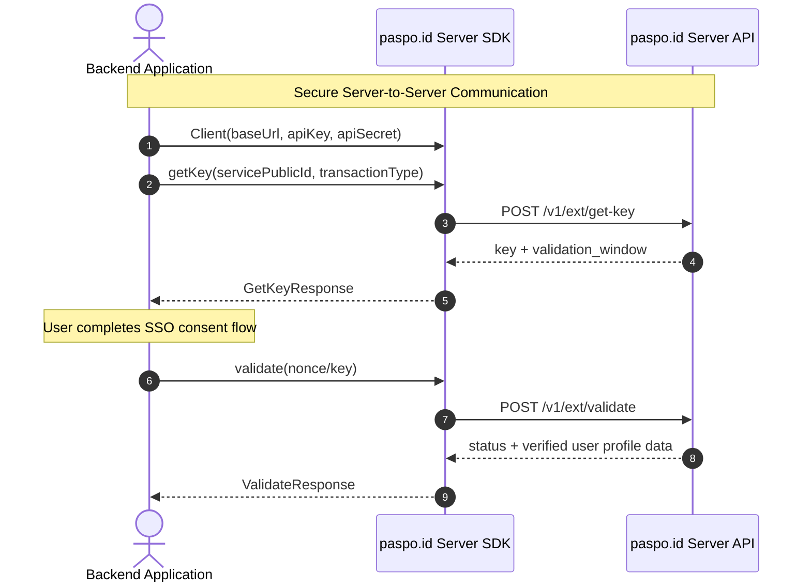

# paspo.id Server API Java & Kotlin SDK

Official Java and Kotlin SDK for integrating backends with the **paspo.id Server API** (Transaction and Authentication Service).

---

## 📋 Overview

The Paspo ID Server API SDK allows backend services to initiate authentication transactions, issue temporary transaction keys, and validate nonces with the Paspo ID identity provider.

* **Kotlin Coroutines** support for idiomatic non-blocking execution.
* **Java CompletableFuture (`*Async`)** support for enterprise Java services.
* **AutoCloseable** client for seamless resource management and OkHttp connection pooling.

---

## ⚙️ Requirements

* **Java**: 17 or higher
* **Kotlin**: 1.9.x / 2.x (optional)

---

## 📦 Installation

Add the Paspo ID CDN repository and the `server-api` dependency to your build configuration.

### Gradle (Kotlin DSL - `build.gradle.kts`)

```kotlin
// settings.gradle.kts
dependencyResolutionManagement {
    repositories {
        mavenCentral()
        maven(url = "https://cdn.paspo.id/cdn/server-api/paspoid")
    }
}

// build.gradle.kts
dependencies {
    implementation("paspoid:server-api:0.1.0")
}
```

### Gradle (Groovy DSL - `build.gradle`)

```groovy
// settings.gradle
dependencyResolutionManagement {
    repositories {
        mavenCentral()
        maven { url 'https://cdn.paspo.id/cdn/server-api/paspoid' }
    }
}

// build.gradle
dependencies {
    implementation 'paspoid:server-api:0.1.0'
}
```

### Maven (`pom.xml`)

```xml
<repositories>
    <repository>
        <id>paspo-cdn</id>
        <name>Paspo ID CDN Repository</name>
        <url>https://cdn.paspo.id/cdn/server-api/paspoid</url>
    </repository>
</repositories>

<dependencies>
    <dependency>
        <groupId>paspoid</groupId>
        <artifactId>server-api</artifactId>
        <version>0.1.0</version>
    </dependency>
</dependencies>
```

---

## 🚀 Quick Start

### Kotlin Example

```kotlin
import id.paspo.sdk.Client
import id.paspo.sdk.exceptions.PaspoidException
import kotlinx.coroutines.runBlocking

fun main() = runBlocking {
    val client = Client(
        baseUrl = "https://paspo.id",
        apiKey = "YOUR_API_KEY",
        apiSecret = "YOUR_API_SECRET"
    )

    client.use { ssoClient ->
        try {
            // 1. Obtain a temporary transaction key
            val keyResponse = ssoClient.getKey(
                servicePublicId = "YOUR_SERVICE_PUBLIC_ID",
                transactionType = "phones"
            )
            println("Key: ${keyResponse.key}")
            println("Validation Window: ${keyResponse.validationWindow}")

            // 2. Validate transaction status using the key/nonce
            val valResponse = ssoClient.validate(keyResponse.key)
            println("Status: ${valResponse.status}")
            println("Data Type: ${valResponse.dataType}")
            println("Data Value: ${valResponse.dataValue}")
        } catch (e: PaspoidException) {
            println("SDK Error: ${e.message}")
        }
    }
}
```

### Java Example

```java
import id.paspo.sdk.Client;
import id.paspo.sdk.responses.GetKeyResponse;
import id.paspo.sdk.responses.ValidateResponse;

public class Main {
    public static void main(String[] args) {
        String baseUrl = "https://paspo.id";
        String apiKey = "YOUR_API_KEY";
        String apiSecret = "YOUR_API_SECRET";

        try (Client client = new Client(baseUrl, apiKey, apiSecret)) {
            // 1. Obtain a transaction key asynchronously
            GetKeyResponse keyResp = client.getKeyAsync("YOUR_SERVICE_PUBLIC_ID", "phones").get();
            System.out.println("Key: " + keyResp.getKey());
            System.out.println("Validation Window: " + keyResp.getValidationWindow());

            // 2. Validate transaction status
            ValidateResponse valResp = client.validateAsync(keyResp.getKey()).get();
            System.out.println("Status: " + valResp.getStatus());
            System.out.println("Data Type: " + valResp.getDataType());
            System.out.println("Data Value: " + valResp.getDataValue());
        } catch (Exception e) {
            System.err.println("Error executing paspo.id SDK: " + e.getMessage());
        }
    }
}
```

---

## 🔄 Integration Flow



---

## 🛠 API Reference

### `Client`

```kotlin
class Client @JvmOverloads constructor(
    baseUrl: String,
    apiKey: String,
    apiSecret: String
) : AutoCloseable
```

| Method | Return Type | Description |
| :--- | :--- | :--- |
| `getKey(servicePublicId, transactionType)` | `suspend GetKeyResponse` | Requests a new transaction key (Kotlin coroutine) |
| `getKeyAsync(servicePublicId, transactionType)` | `CompletableFuture<GetKeyResponse>` | Requests a new transaction key (Java async) |
| `validate(nonce)` | `suspend ValidateResponse` | Validates transaction status by nonce (Kotlin coroutine) |
| `validateAsync(nonce)` | `CompletableFuture<ValidateResponse>` | Validates transaction status by nonce (Java async) |
| `close()` | `Unit` | Releases internal HTTP client resources |

---

## 🚨 Error Handling

All SDK exceptions inherit from `PaspoidException`:

* **`ConfigurationException`**: Invalid SDK initialization arguments (e.g. missing API keys or base URL).
* **`RequestValidationException`**: Invalid method parameters passed to the SDK.
* **`TransportException`**: Network errors, timeouts, or connectivity issues.
* **`ApiException`**: Server returned an HTTP error status (4xx / 5xx) or an API-level error code.
* **`DecodeException`**: Response parsing or deserialization failures.

---

## 📄 License

Distributed under the **Apache License 2.0**. See [`LICENSE`](LICENSE) for more details.
