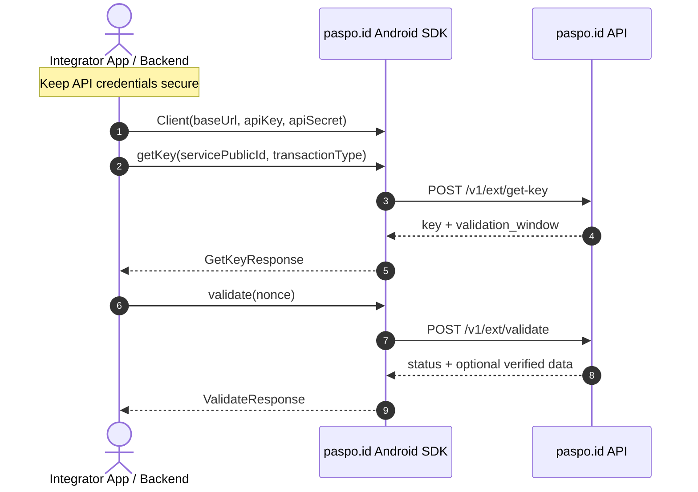

# paspo.id Server API Android (Kotlin) SDK

The official Android / Kotlin SDK for integrating with the **paspo.id Server API** (Transaction and Authentication Service).

---

## 📦 Installation

Add the dependency to your app module's `build.gradle.kts`:

```kotlin
dependencies {
    implementation("id.paspo:sdk:0.1.0")
}
```

---

## 🚀 Quick Start

```kotlin
import id.paspo.sdk.Client
import id.paspo.sdk.exceptions.PaspoidException
import kotlinx.coroutines.launch

val client = Client(
    baseUrl = "https://paspo.id",
    apiKey = "YOUR_API_KEY",
    apiSecret = "YOUR_API_SECRET"
)

// Inside CoroutineScope (e.g. viewModelScope or lifecycleScope):
lifecycleScope.launch {
    try {
        // 1. Obtain a transaction key
        val keyResponse = client.getKey(
            servicePublicId = "YOUR_SERVICE_PUBLIC_ID",
            transactionType = "phones"
        )
        println("Key: ${keyResponse.key}")
        println("Validation Window: ${keyResponse.validationWindow}")

        // 2. Validate transaction status
        val valResponse = client.validate(keyResponse.key)
        println("Status: ${valResponse.status}")
    } catch (e: PaspoidException) {
        println("SDK Error: ${e.message}")
    }
}
```

---

## 🛠 API Methods

### `client.getKey(servicePublicId: String, transactionType: String): GetKeyResponse`
Requests a temporary transaction key.

### `client.validate(nonce: String): ValidateResponse`
Checks transaction status for the provided nonce.

---

## 🔄 Integration Flow



---

## 📄 License

Distributed under the MIT License.
